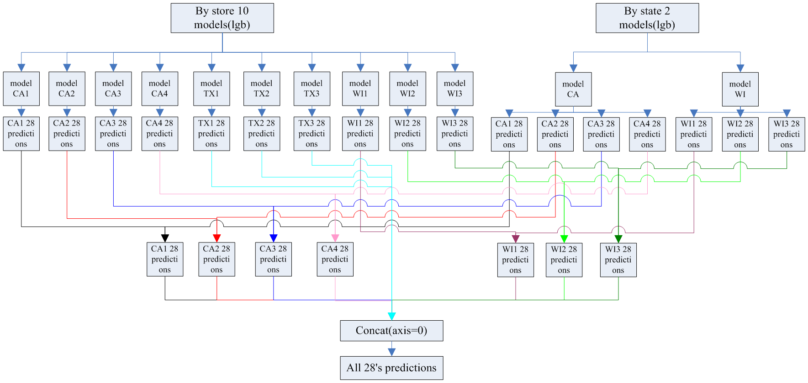

# Kaggle_M5_Forecasting_Accuracy_top4%
This is a competition M5 forecasting - accuracy on kaggle. For details, please refer to the link: https://www.kaggle.com/c/m5-forecasting-accuracy/overview. 
This is my first time to take part in the kaggle competition. After two months of hard work, I finally ranked 172, top4% and won a silver medal.

# Catalogue introduction
datasets --> The directory where the dataset is stored.  
features --> The pkl file for generating features is stored in this directory.  
models --> The model files generated in the training process are placed in it.  
sub --> The generated CSV file is placed in this directory.
codes --> It contains the code used in this competition.
    utils.py --> Contains some of the functions used.  
    fe.py --> Execution via Python fe.py generate feature files to the features directory.  
    train_state.py --> By training the dataset according to the state partition, the state.csv will be created in the sub directory.  
    train_store.py --> By training the dataset according to the store partition, the store.csv will be created in the sub directory.  
    fusion.py --> The state.csv and store.csv are weighted and fused according to different weights.  
other --> It contains some of the things used in the competition.

# How to run
You can git clone to the local directory and execute python scripts.py at the terminal.

**scripts.py** will execute the following documents in turn:

1.Python fe.py  
2.Python train_state.py  
3.Python train_store.py  
4.Python fusion.py  

# Overall framework
1. First of all, we passed the fe.py Production features, including holiday features, price features, lag features, etc.  
2. There are three states in this data set, including CA, TX and WI. However, we only read the data of two states according to CA and WI, and use LGB for training, because we found that the effect of reading CA and WI state training is better than that of TX.  
3. We read data from 10 stores, train them separately, and get the model of 10 stores. Finally, we forecast the sales volume of each store in 28 days.  
4. We read the predictions of CA and WI states according to the stores of each state, and get the stores of CA_x and WI_x, respectively, and weighted fusion with the predicted stores of CA_x and WI_x to get the final result. The overall flow is shown below：  

